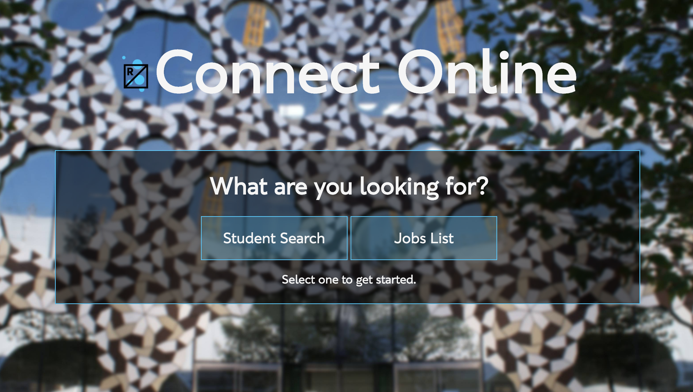

#Summative Hand-in Package
**Name:** Dean Chalk

**Student No:** 96291515

**Course:** BA (Hons) Web Media, Level 2

**Unit Code:** WEB14203

[**Markdown GitHub Link**](https://github.com/deanlc/SharingIsCaring/blob/gh-pages/Dean-Chalk-WEB14105.md)

##Introduction
During this term we designed a template for a wep app, then chose an idea and built up the template around that. For my web app I tried to improve upon Ravensbourne Connect by creating Connect Online.

##Links
- [Summative Presentation Link](https://docs.google.com/presentation/d/1B3YE9YikIW09d-j5_sskQmHTveKcr29P5vuTytOwukE/edit?usp=sharing)
- [GitHub Pages](https://deanlc.github.io/App/)
- I used 2 pushers for my project, [People Pusher](https://thimbleprojects.org/onaed/131450/) & [Jobs Pusher](https://thimbleprojects.org/onaed/139431/)
- [Codewars Profile](https://www.codewars.com/users/deanlc)